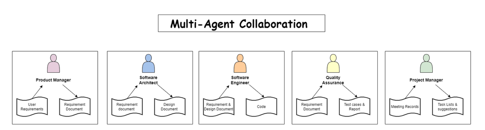

# Multi-Agent Software Engineering System

A modular multi-agent AI system that simulates a real software development team using role-based AI agents orchestrated through LangGraph.

The system decomposes software development into structured workflows handled by specialized agents:
Product Management → Architecture → Development → QA → Execution

---

##  Problem Statement

Modern software engineering workflows involve multiple specialized roles:
- Product Managers define requirements
- Architects design system structure
- Engineers implement code
- QA ensures correctness
- Coordination between roles is manual and slow

This project automates that entire workflow using a **multi-agent AI system**.

---

##  System Overview

This system consists of 5 AI agents:

###  Product Manager Agent
- Converts user requirements into structured specifications
- Defines scope and constraints

### Software Architect Agent
- Designs system architecture and component breakdown
- Ensures modular and scalable design

###  Software Engineer Agent
- Implements actual code based on architecture
- Focuses on correctness and execution

###  QA Agent
- Generates test cases
- Validates correctness of implementation

###  Project Manager Agent
- Coordinates workflow between all agents
- Ensures end-to-end task completion

---

##  Orchestration Layer

The entire system is orchestrated using **LangGraph**, enabling:

- State-based workflow execution
- Multi-step agent transitions
- Controlled reasoning flow
- Persistent execution context

##  System Architecture

Below is the high-level architecture of the multi-agent system:

---

##  Tech Stack

- Python
- LangGraph (multi-agent orchestration)
- LLM APIs (OpenAI / Llama / Mistral)
- HTML (generated UI output)
- Modular Python architecture

---

##  Key Highlights

- Designed a **5-agent collaborative AI system**
- Implemented structured workflow orchestration using LangGraph
- Simulates real-world SDLC (Software Development Life Cycle)
- Enables automated software generation pipeline
- Modular architecture allows easy extension of new agents

---

##  Design Decisions

### 1. Role-Based Agents
Each agent represents a real-world software engineering role.

### 2. Graph-Based Execution
LangGraph enables controlled transitions instead of linear pipelines.

### 3. State Management
Shared state ensures context consistency across agents.

### 4. Separation of Concerns
Agents, orchestration, and UI are fully decoupled.

---

##  Future Improvements

- Add memory layer for long-term agent context
- Integrate evaluation-based self-refinement loop
- Add real-time UI dashboard for workflow visualization
- Introduce reinforcement learning for agent optimization
- Expand to multi-project parallel execution

---

##  What This Project Demonstrates

- Multi-agent system design
- LLM orchestration using graph-based workflows
- Production-style AI system architecture
- Real-world SDLC automation
- Modular and scalable AI engineering design

