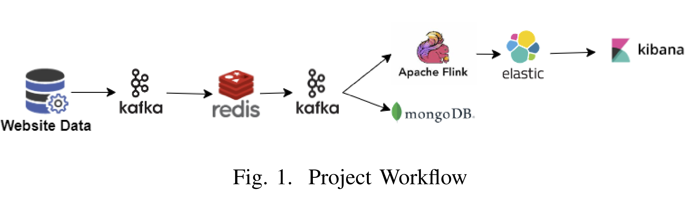

# Real-Time E-Commerce Analytics Pipeline

This project introduces a **hybrid analytical framework** for real-time e-commerce analytics by combining stream processing and offline machine learning. It simulates a furniture e-commerce platform to analyze user behavior, enhance session tracking, and provide actionable business intelligence.

---

## 🌐 Project Overview

The landscape of e-commerce analytics is rapidly evolving with the advent of real-time data processing and machine learning. While most prior works focused on **either** offline batch processing **or** real-time monitoring, this project bridges the gap with a **dual-pipeline architecture**.

It leverages:
- 🔄 Real-time stream analytics using **Apache Kafka**, **Redis**, and **Flink**
- 📊 Offline predictive modeling using **MongoDB**, **LSH**, **XGBoost**, **ANNs**, and **SHAP**
- 🛡️ Privacy protection via **Differential Privacy**
- 📈 Dashboard visualization using **Elasticsearch** and **Kibana**

---

## 🧰 Tech Stack

| Layer               | Tools & Technologies                                             |
|--------------------|------------------------------------------------------------------|
| Ingestion          | Kafka                                                            |
| Stream Processing  | Redis (security & session counts), Apache Flink                 |
| Storage            | MongoDB (offline analysis), Elasticsearch (real-time querying)   |
| ML & Privacy       | XGBoost, ANN, Random Forest, LSH, SHAP, Differential Privacy     |
| Visualization      | Kibana                                                           |

---

## 🔁 Project Workflow

---

## 🔍 Key Features

- **Dual-pipeline hybrid architecture**: balances immediate insights with strategic analysis
- **Synthetic data simulation**: includes users, sessions, and product interaction data
- **Real-time Redis layer**: performs instant security checks and session-level metrics
- **Flink pipeline**: enriches and validates live data streams
- **Offline ML pipeline**: predicts purchases using LSH and interpretable models (SHAP)
- **Dashboards**: dynamic real-time insights into user/product/session behavior

---

## 📈 Outcomes

- ⏱️ End-to-end latency reduced by 30%
- 📊 Improved model explainability and user-level personalization
- 🔒 Integrated privacy preservation through differential privacy

---

> _This project showcases the synergy between real-time responsiveness and in-depth offline analysis — critical for scalable and intelligent e-commerce platforms._
